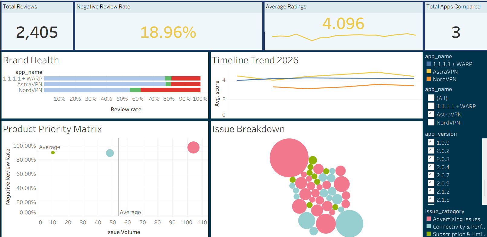

# 📊 AstraVPN: App Review Analytics & Competitor Benchmarking

## Overview
Analyzed 9,405 Google Play reviews from AstraVPN and key competitors (1.1.1.1 + WARP, NordVPN) to evaluate brand health, identify user pain points, and prioritize product improvements through an interactive Tableau dashboard.

## Business Questions
- How does AstraVPN's brand health compare with its competitors?
- Is product quality improving or declining over time?
- What issues drive negative reviews?
- Which app versions generate the most complaints?
- What problems should be prioritized first?

## Dashboard Preview

## Key Findings
- Although AstraVPN recorded the highest positive review rate (77.75%), its average rating review remained below 1.1.1.1 + WARP because it received a higher share of negative reviews.
- AstraVPN's rating trend showed notable fluctuations, dropping to 3.96 in February 2026 before recovering to 4.78 in May 2026, suggesting inconsistent user experience across releases.
- Advertising Issues and Connectivity & Performance emerged as the largest sources of negative feedback, particularly in version 2.0.3.
- A Product Priority Matrix (Priority Score = Issue Volume × Negative Review Rate) identified Advertising Issues as the highest-priority problem, with a 97.12% negative review rate and the highest Priority Score.

## Tools & Technologies
Python • Pandas • Google Play Scraper • SQL • Tableau Public • Product Analytics • Data Visualization

## Live Dashboard
[View Dashboard](https://public.tableau.com/views/AstraVPNAppReviewAnalyticsCompetitorBenchmarking/Dashboard1?:language=en-US&:sid=&:redirect=auth&:display_count=n&:origin=viz_share_link)
